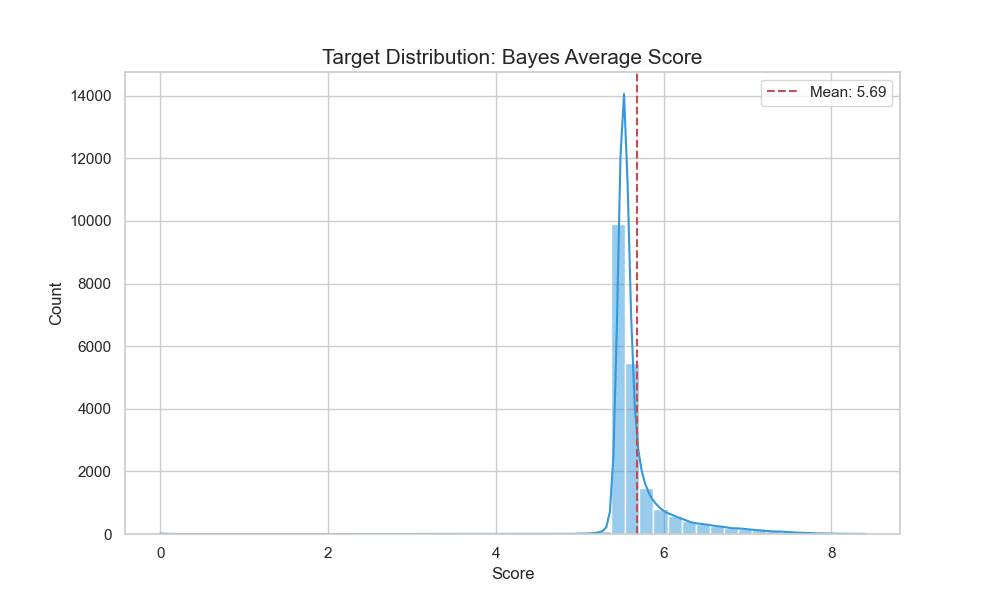
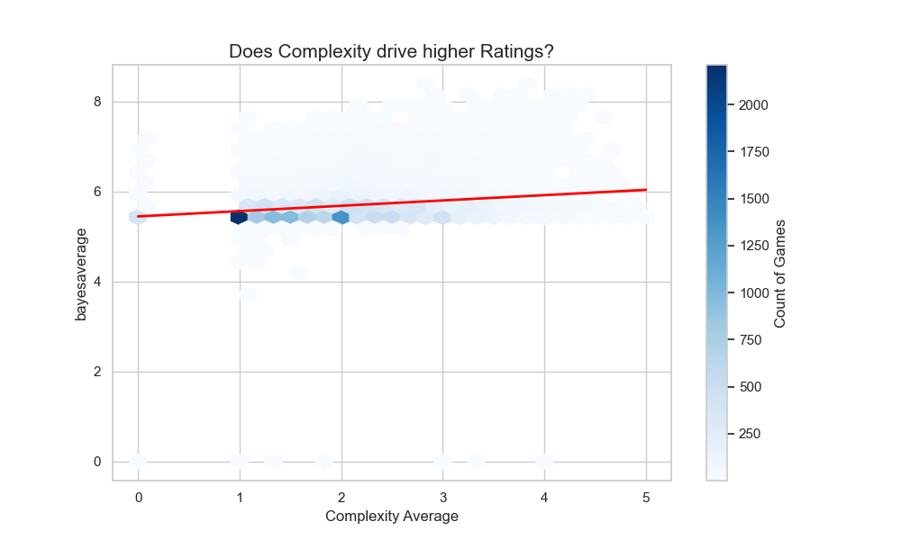
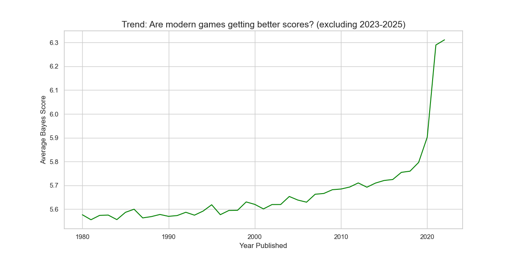
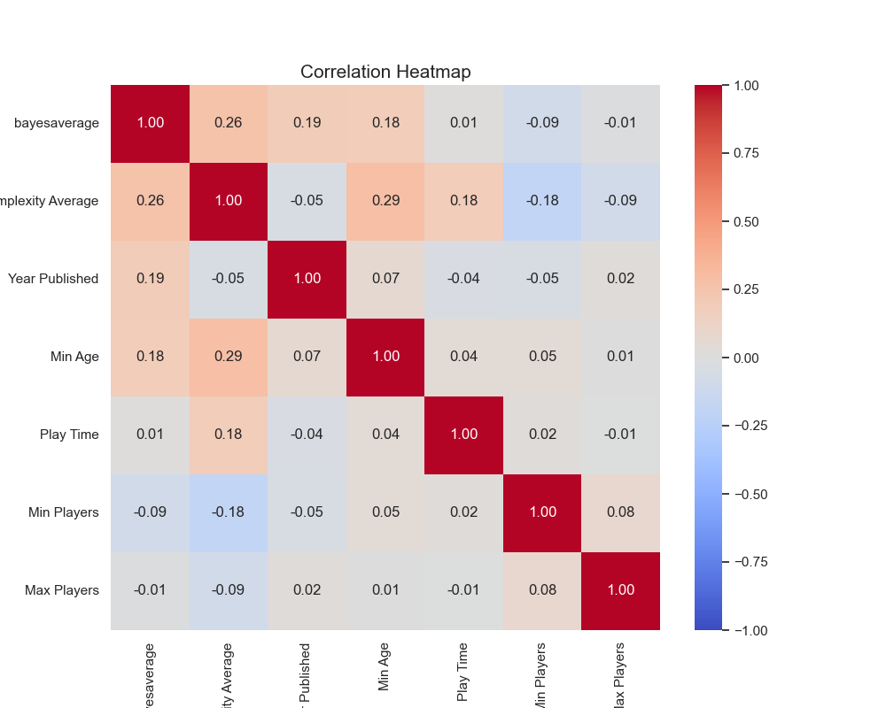
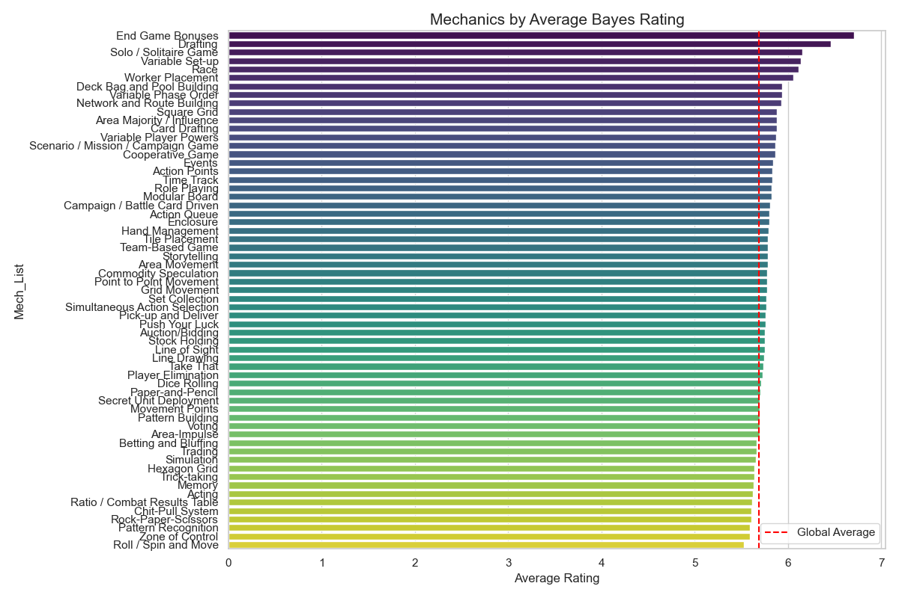
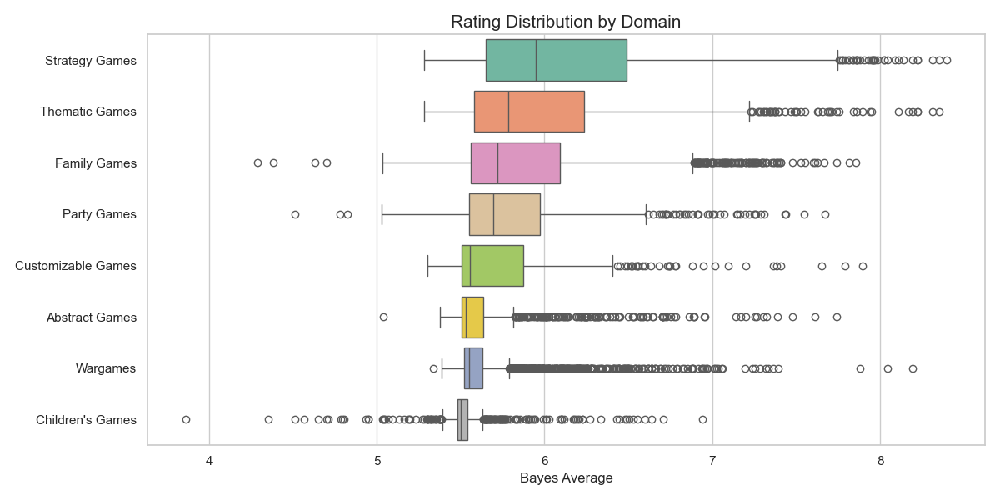
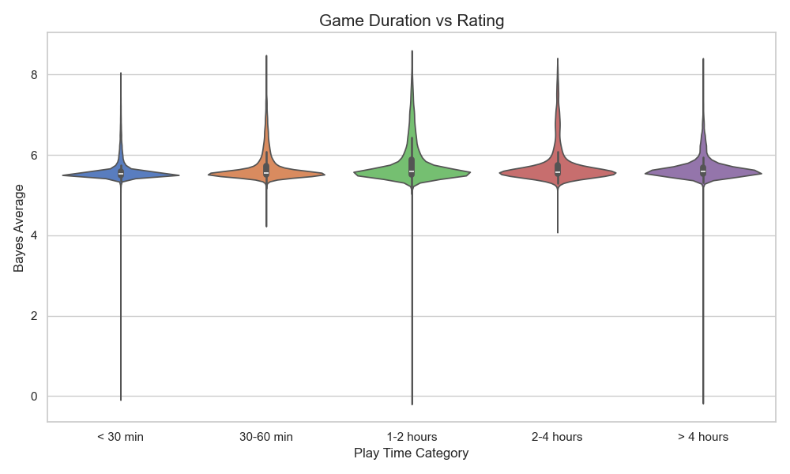

[TOC]

# choosing features
to avoid data leakage, we will drop these columns before training:
* bgg rank/rank: since rank is decided by the bayes average, aka the target.
* rating average: it is a variant of bayes average, which is calculated from the average.
* users rated: when we predict a new game, it is impossible to know how many people will rate it.
* owned users: the same as users rated. the number is a result of market performance.
* name: it has little impact on prediction of bayes average.

# data preprocessing
cross conference to fix year published:
* if year published is invalid(<1900 or > 2025) in the left table, try to use year published in the right table.
* if both values of year published in two tables are invalid, drop the row.
* we successfully fixed 238 rows which had invalid year published in this way.

# EDA

## distribution of bayes average score

The data distribution is negatively skewed and clusters within a specific interval.  
### reasons of negative skewness
1. Psychological Factor  
For a game universally considered bad, most people won't even play and rate it. Most of the scores that can be recorded fall between "okay" and "very good". Truly bad games (1-3 points) have extremely small sample sizes because nobody plays them.
2. Mathematical Factor  
BGG forcibly set the benchmark score for all games at 5.5. For a standard 1-10 rating system, theoretical median is 5.0. However, BGG considers a "decent" published game to start with a score of 5.5. This 0.5-point deviation causes the entire distribution chart to shift to the right. 
### Meaning for model
The prediction difficulty is extremely high: the model is not predicting a broad range of 1 to 10, but rather a very narrow 3-point interval of 5.5 to 8.5. A relatively small RMSE might also mean a large error.

## Complexity vs bayes average score

The ascending trend confirms the preferences of hardcore BGG players: simple party games typically score low, while complex strategy games score high.

## year published vs bayes average score

### reasons of tail dropping
It is a "newbie protection period/penalty mechanism" set up by BGG to prevent "score boosting".
#### core reason: Bayesian Smoothing
BGG's ranking is based on "Geek Rating", a weighted, Bayesian average that incorporates "dummy" votes to prevent new games with few, skewed ratings from dominating rankings, making it more reliable than the simple average rating for overall ranking.  
  

Its calculation formula is roughly logical as follows (simplified version):

$$\text{Bayes Score} = \frac{(C \times \text{Rating}) + (M \times 5.5)}{C + M}$$  
$C$ = number of real reviews  
$\text{Rating}$ = real average rating from users  
$M$ = dummy votes.   

BGG will force approximately 1k-2k tickets with a score of 5.5(mediocre) into each game.  

The drop at the end of the curve is actually because the number of users rating the new game has not yet accumulated enough, and it has been "anchored" by the algorithm to the baseline of 5.5.
#### Secondary cause: Survivorship bias
The older games still at the top of the charts are classics. The bad games have long since been forgotten, so the average scores appear high.  
Current years: all games(good, bad, mediocre) are mixed together, and haven't yet had time to be filtered. With such a mixture, the average scores will naturally be lower.  
### Meaning for model
1. The necessity of feature interaction:   
It proves that using year published alone is insufficient, as it has a very strong interaction with users rated. But we cannot use users rated because it is a post-event feature.
2. Cut-off strategy:   
we can exclude data in latest 1-2 years. The bayes scores in this part of the data are due to "low votes" instead of "game mechanics". If the model is trained on this data, it will incorrectly assume that "newer years = lower scores", which contradicts the long-term trend of "design evolution" (newer years = higher scores) and will interfere with the model's learning.  
  
after cutting-off:

## Correlation heatmap (numerical characteristics)

* There is a strong positive correlation between complexity and minimum age (the more difficult the game, the older the age requirement)
* Complexity and play time are positively correlated (hardcore games typically take longer).
* Min players and bayes average have a low correlation, indicating that whether a game is fun or not has little to do with how many people are playing it.

## Mechanics vs bayes average score

* Games with mechanics such as Campaign / Battle Card Driven and Worker Placement, are popular. Only the most hardcore gamers play highly complex, long-running, and immersive games, and these are the gamers who are most willing to give them high scores.
* Acting / Singing and Roll / Spin and Move often mean that the target audience is children/non-gamers, or that luck outweighs strategy. In geek community of BGG, these kinds of games rarely receive high ratings.

## Domains vs bayes average score

* Strategy games and thematic games have higher bayes average mean. They are favourites among BGG core users.
* Family games have a wide audience but lack depth, making it difficult to achieve a super high score of 8.5+. But they are relatively stable.
* Children games are considered too "childish", lacking motivation to rate them, and BGG's algorithm penalizes games with low votes.
## Play time vs bayes average score

* under 30 minutes: It is hard to tell a profound story or develop deep mechanics, resulting in a lower score ceiling.
* 1-2 hours: It is the most comfortable range for BGG players. It's challenging enough, but not too tiring.
* over 4 hours: As very few people can play games for more than 4 hours, the sample size is small. Although there are few people, those who are willing to sit down and play for 4 hours are usually die-hard fans and rarely give low scores. The variance here can be huge, either a masterpiece or torture.